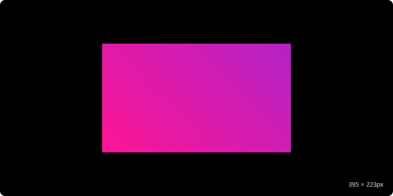

# Logomaker: AI-Enhanced Logo Generator (An Experiment in Vibe Coding ✨)

[](./LICENSE) [](https://manicinc.github.io/logomaker/) [](https://github.com/sponsors/manicinc)

Logomaker is a free, open-source, client-side text logo generator featuring ~400 fonts, dynamic effects, and versatile export options. Designed for **extreme portability** and **offline-first use**, it leverages an optimized build process with intelligent font loading.

This project is more than just a tool; it's a **Human+AI collaborative coding experiment** developed by [Manic Agency](https://manic.agency). Roughly 90% of the codebase originated from AI (LLMs like GPT-4, Claude 3, Gemini families) guided by **technical prompt engineering** and refined through an **iterative collaborative development and testing process**, or **✨ Vibe Coding ✨** – an attempt to harness AI for rapid development while maintaining robust engineering practices and a distinct creative workflow. It's a practical look at the potential and challenges of this emerging development paradigm, built by an agency focused on experimental tech (AR/VR, AI/ML, GenAI, Crypto, Game Design).

See the [Technical Deep Dive (coming soon)](https://manic.agency/blog) and [architecture.md](./architecture.md) for more insights into the process and structure.

---


---

## 🚀 Using Logomaker

Choose the version that best suits your needs:

**1. Live Demo (Online - Optimized Build)** ⚡

The fastest way to get started. Experience the web-optimized version with dynamic font loading.

➡️ **[Try Logomaker Online Now!](https://manicinc.github.io/logomaker/)**
* Uses the optimized build (`dist/github-pages`).
* Loads a small font index (~100KB) initially, then fetches font data chunks (`*.json`) on demand.

**2. Portable Version (Offline - Single File or Folder)** 📦

Ideal for offline environments, workshops, or easy sharing.

* **Build it first:** Run `node scripts/build.js` or `node scripts/build.js --target=portable` locally (see instructions below).
* **Single File:** If `dist/portable/logomaker-portable.html` exists (requires the `portapack` dev dependency: `npm install -D portapack`), open this single file in any modern browser. All assets, including fonts (Base64 encoded), are embedded.
* *Note:* Expect a **significantly slower initial load** compared to the optimized version due to the large (~90-100MB) embedded font data.

## 🛠️ Local Development

### Prerequisites
- [Git](https://git-scm.com/downloads)
- [Git LFS](https://git-lfs.com)
- [Node.js](https://nodejs.org/) (v18+)

### Quick Start
```bash
# Clone & Setup
git clone https://github.com/manicinc/logomaker.git
cd logomaker
git lfs pull
npm install

# Build Options
npm run build           # Build both optimized & portable versions
npm run build:deploy    # Build for GitHub Pages
npm run build:portable  # Build offline version

# Local Testing
npm run serve           # Serve optimized version
npm run serve:portable  # Serve portable version
---
```

## ✨ Features Overview

* **🔤 BYOF Font Library with defaults:** ~400 fonts available. Dynamically loaded online (chunked w/ IndexedDB caching) or fully embedded offline, with font licensing support.
* **🌈 Vibrant Gradients:** Apply multi-color gradients with presets or full customization.
* **✨ Dizzying Effects:** Enhance text with glows, shadows, outlines, retro styles, emboss, inset effects – all color-customizable.
* **🔲 Flexible Borders:** Frame logos with various styles (solid, dashed, pixelated, glowing). *Note: Complex borders simplified in SVG exports.*
* **🎬 Engaging Animations:** Apply subtle animations (Pulse, Bounce, Glitch, etc.). Control speed. Included directly in SVG exports via CSS!
* **📦 Pro Export Options:**
    * **SVG:** Clean, scalable vectors. Embeds fonts (via `@font-face` data URLs) & CSS animations. Ideal for web/editing.
    * **PNG:** High-quality raster images with optional transparency. Control resolution and quality.
    * **Frames (ZIP):** Animation sequence as individual PNG frames + HTML preview.
* **🔗 Shareable URLs:** Generate unique links capturing your exact design state.
* **🌓 Light/Dark Themes:** Adapts to system preference or toggle manually.
---

## 🤔 Performance & Loading: Optimized vs. Portable

Logomaker employs distinct loading strategies tailored for different use cases:

* **Optimized Version (`dist/github-pages` / Live Demo):**
    * **Mechanism:** Uses **Font Chunking**. `fontManager.js` loads a small `index.json` (~100KB) containing font metadata. When a font is needed, its specific data chunk (`a-f.json`, `g-m.json`, etc.) is fetched from the `./font-chunks/` directory. Downloaded chunks are cached in **IndexedDB** for persistence. `@font-face` rules are injected dynamically.
    * **Pros:** ✅ **Fast initial load** online. ✅ Efficient bandwidth usage (only load needed fonts). ✅ Persistent caching via IndexedDB.
    * **Cons:** Requires a web server. Needs an internet connection for uncached fonts.
* **Portable Version (`dist/portable`):**
    * **Mechanism:** **Embeds all font data** (Base64 encoded, ~90-100MB+) directly into `inline-fonts-data.js` or bundles everything into a single HTML file using `portapack`. `fontManager.js` detects this embedded data (`window._INLINE_FONTS_DATA`) and uses it directly.
    * **Pros:** ✅ Works **completely offline** from anywhere (web server, `file:///`). ✅ Single file option for ultimate portability.
    * **Cons:** ⚠️ **Very slow initial load** and high memory usage due to the large embedded data blob.

**The build script (`node scripts/build.js`) handles the complexities of generating both modes.**

---

## 🛠️ Technical Deep Dive: The "Vibe Coding" Experiment

Logomaker's development was a deliberate exploration of **Human+AI Collaborative Coding**, termed "Vibe Coding".

* **Process:** Involved defining requirements and architecture, then using **technically-guided prompt engineering** with LLMs to generate initial code structures, functions, and UI elements. This was followed by rigorous **human testing, debugging, refactoring, and integration**. No significant function was purely hand-written; AI provided the initial drafts or suggestions, which were then iteratively refined.
* **Goal:** To investigate if this collaborative "vibe" could accelerate development while producing a reasonably complex, functional application. It highlights the strengths of AI in boilerplate generation and exploring implementation options, alongside the indispensable role of human expertise in architecture, validation, and ensuring robustness.
* **Architecture:** See [**architecture.md**](./architecture.md) for a breakdown of components, the rendering flow, and more on the Human+AI model.
---

## ⚠️ Known Limitations & Future Ideas

* **CSS ➡️ Export Fidelity:** Complex CSS effects (especially advanced filters, masks, intricate backgrounds/borders) may render differently or be simplified in SVG/PNG exports compared to the live browser preview.
* **Animation Export:** Generating many PNG frames (>50-100) for the ZIP export can be slow and memory-intensive in the browser.
* **Future Polish:** More robust font weight/style validation, better text overflow handling, additional effects/animations/patterns, improved theming capabilities.
* **Electron App:** Wrapping the application for native desktop use remains a potential future enhancement.
* **QR Codes:** Requires manually uncommenting and including an external library (`davidshimjs-qrcodejs`) in `index.html` for the Share URL modal QR code functionality.
---

## ❤️ Support & Connect

Find Logomaker useful or intriguing? Consider supporting its development and future experiments!

[](https://github.com/sponsors/manicinc) | [](https://buymeacoffee.com/manicinc) | [](https://twitter.com/intent/tweet?text=Exploring%20Logomaker%20-%20a%20free,%20offline-first%20logo%20tool%20built%20via%20Human%2BAI%20'Vibe%20Coding'!&url=https%3A%2F%2Fmanicinc.github.io%2Flogomaker)

**Connect with Manic Agency:** (Experimental Design & Development: AR/VR, AI/ML/GenAI, Crypto, Game Design)

[](https://manic.agency) | [](mailto:team@manic.agency) | [](https://github.com/manicinc) | [-@manicagency-blue?style=flat-square&logo=x)](https://x.com/manicagency) | [](https://twitter.com/manicagency)

---

## 📄 License

This project is licensed under the **MIT License**. See the [LICENSE](./LICENSE) file for details.

---

🚀 Crafted by [Manic Agency](https://manic.agency)
