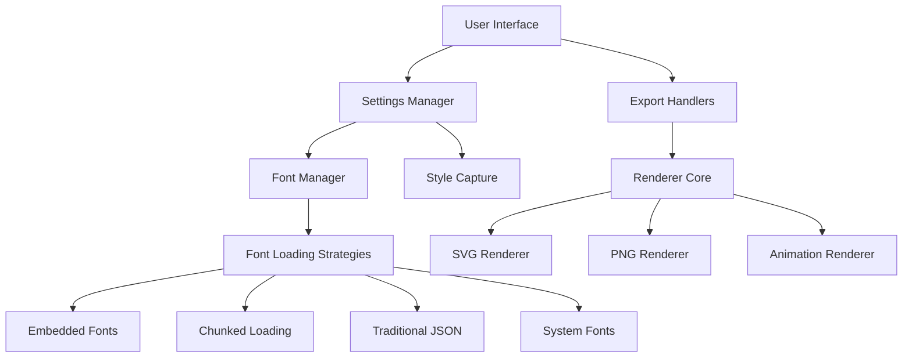

# Logomaker 🚀

## Overview

Logomaker is an advanced, client-side Single Page Application (SPA) for logo creation, developed by Manic Agency. Designed with extreme portability, offline functionality, and performance in mind.

## Core Philosophy

- **Client-Side Rendering:** 100% browser-based logo generation
- **Extreme Portability:** Runs from a single HTML file
- **Offline First:** Complete functionality without internet
- **SVG as Source of Truth:** Primary logo representation

## System Architecture

### Architectural Diagram



## Key Components

### 1. User Interface
- Dynamic control elements
- Real-time logo preview
- Responsive design
- Minimal external dependencies

### 2. Settings Management
- State tracking
- UI control bindings
- Persistent state via:
  - Local Storage
  - URL Parameters
- Change detection and propagation

### 3. Font Management Strategies

#### Loading Approaches
1. **Embedded Mode**
   - All fonts pre-loaded
   - Complete offline capability
   - Larger initial payload

2. **Chunked Loading**
   - Minimal initial load
   - On-demand font retrieval
   - IndexedDB caching

3. **Traditional JSON**
   - Single file font metadata
   - Local development fallback

4. **System Font Fallback**
   - Graceful degradation
   - Ensures basic functionality

### 4. Rendering Pipeline

#### Rendering Strategies
- **SVG Renderer**
  - Pristine vector representation
  - Computed style preservation
  - Font embedding

- **PNG Renderer**
  - Multiple export techniques:
    1. html2canvas
    2. SVG to Canvas conversion
    3. Direct DOM snapshot

- **Animation Renderer**
  - Frame-by-frame generation
  - Keyframe interpolation
  - ZIP package export

## Build & Deployment

### Build Targets

1. **Portable Build**
   - Single HTML file
   - Embedded fonts
   - Complete offline use

2. **Web Deployment**
   - Chunked font loading
   - Optimized initial payload
   - Network-assisted features

### Build Scripts

```bash
# Build deploy (web) target
node scripts/build.js --target=deploy

# Build portable (offline) target
node scripts/build.js --target=portable

# Serve deploy target locally
node scripts/build.js --serve

# Serve portable target locally
node scripts/build.js --serve --portable
```

## Font Processing Workflow

1. **Conversion**: `convert-fonts.sh`
   - Transforms .otf to web-optimized .woff2
   - Robust error handling

2. **Metadata Generation**: `generate-fonts-json.js`
   - Scans font directories
   - Extracts metadata
   - Generates:
     - `fonts.json`
     - `inline-fonts-data.js`
     - `generated-font-classes.css`

3. **Chunk Splitting**: `split-fonts.js`
   - Breaks monolithic font data
   - Creates optimized loading chunks

## Performance Optimizations

- Lazy loading
- Efficient caching
- Minimal DOM manipulation
- Progressive enhancement
- Web Worker potential (future)

## Export Capabilities

| Format     | Features                           | Rendering Strategy         |
|------------|------------------------------------|-----------------------------|
| SVG        | Scalable, Portable                 | Direct DOM Cloning          |
| PNG        | Raster Image, Transparency         | Multiple Rendering Methods  |
| Animation  | Frame Sequence, Preview Included   | Keyframe Interpolation      |

## Error Handling & Resilience

- Centralized error management
- Graceful degradation
- User-friendly notifications
- Optional telemetry

## Development Philosophy

**Human+AI Collaborative Coding**
- Human architectural oversight
- AI-assisted implementation
- Iterative refinement
- Rapid prototyping

## License & Attributions

- Respect individual font licenses
- Clear attribution mechanisms
- Embedded license metadata

## Future Roadmap

- Web Worker rendering
- Advanced text effects
- Collaborative editing
- Cloud synchronization
- Enhanced accessibility

## Contributing

1. Follow existing code structure
2. Comprehensive error handling
3. Update documentation
4. Write tests

## `.gitignore` Essentials

```gitignore
# System & Development
.DS_Store
Thumbs.db
node_modules/
dist/

# Build Artifacts
font-chunks/
inline-fonts-data.js
fonts.json
logomaker-portable.html

# Logs & Caches
*.log
.npm
.eslintcache

# Environment
.env*
!.env.example
```

---

🚀 Crafted by [Manic Agency](https://manic.agency)